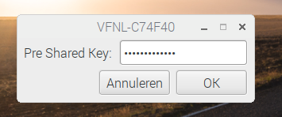

# How to build a package

You can either compile your own binary package from sources, or you can just you a precompiled binary: [download](lxplug-network_0.18_armhf.deb).

If you want to compile it yourself, you will need to build the package on your Raspbery Pi. 

You can use the commands below to build the package from the sources:
```
git clone git@github.com:eugene-blokhin/lxplug-network.git
cd lxplug-network
sudo apt-get build-dep lxplug-network
dpkg-buildpackage -rfakeroot -uc -b 
```

It will create a cusomized *lxplug-network* package. The *.deb* file (installer) can be found in the parent directory now.

# How to install the package

First, you need to uninstall the original package:
```
sudo apt-get uninstall lxplug-network
```

Then, you can just double-click on the .deb file that we bult above. 

The installation is completed. Now you need to reboot your Raspberry Pi.
